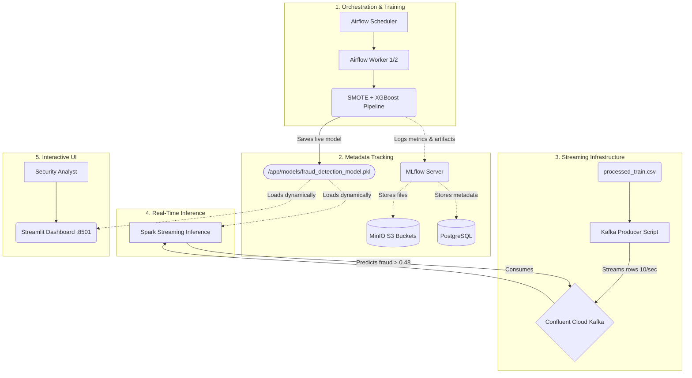

# Real-Time Credit Card Fraud Detection Pipeline/Architecture


An end-to-end, massively parallelized machine learning architecture that simulates thousands of simultaneous global credit card sweeps, predicts fraud in real-time utilizing a custom-trained XGBoost matrix, and streams interceptions natively to a cloud Kafka broker.

---

## High-Level Microservice Architecture

The underlying system is a fully dockerized, deeply integrated microservice mesh consisting of 5 distinct processing tiers communicating over Docker Networking bridges.



---

## ⚙️How It Works Under the Hood

### 1. Advanced Data Engineering
Transforms heavy Kaggle datasets down by extracting Unix timestamps into semantic variables (e.g., `is_weekend`, `is_night`), and using vectorized **Haversine formula math** to identify massive state-line geographic purchase deviations (`distance_km`).

### 2. Autonomous Airflow ML Retraining
Airflow DAGs routinely command Celery workers to rebuild the XGBoost model. It employs **Smart Undersampling** (saving 100% of minority fraud cases while dropping bloated legitimate arrays by 90%) and utilizes **SMOTE** (Synthetic Minority Oversampling) to artificially generate millions of counterfeit transactions for the Neural Network to memorize.

### 3. Asynchronous Confluent Kafka Streaming
A daemonized Python Producer script simulates massive data ingestion. It strips the pre-processed matrix directly off the host volume and injects precisely 10 continuous transactions every second directly into Confluent Cloud.

### 4. Headless PySpark Evaluation
A silent Spark Structure Streaming container binds dynamically to the `transactions` Kafka topic. It translates the JSON payloads back into highly rigid PySpark schema types via `@pandas_udf` constraints and flags the transactions against the live-pickled XGBoost model. Valid frauds are rebounded into the cloud on an isolated `fraud_predictions` Kafka topic.

### 5. Instant UI Dashboarding
Because reviewing terminal JSON data arrays is miserable, a massive `Streamlit` component binds directly over the live Machine Learning module utilizing localized caching, generating an instant HTML form widget to validate unique, randomized terminal swipes globally.

---

## Getting Started (Run Locally)

### Prerequisites:
- `Docker Desktop` (Allocated with a minimum of 6GB RAM)
- `Python 3.9+`

### Installation & Bootup:

**Step 1. Clone & Set your passwords**
Create a `.env` file in the root directory with the following skeleton containing your Confluent Cloud Kafka credentials:

```env
AWS_ACCESS_KEY_ID=minio
AWS_SECRET_ACCESS_KEY=minio123
MINIO_USERNAME=minio
MINIO_PASSWORD=minio123
AIRFLOW_UID=100

KAFKA_BOOTSTRAP_SERVERS=
KAFKA_TOPIC=transactions
KAFKA_PASSWORD=
KAFKA_USERNAME=
```

**Step 2. Download the Dataset**
Download the [Credit Card Fraud Detection Dataset from Kaggle](https://www.kaggle.com/datasets/mlg-ulb/creditcardfraud/data).
Extract the downloaded archive and place the `creditcard.csv` file inside a directory named `FraudDataset` in the root of the project.

**Step 3. Run the Initial Preprocessing Script**
```bash
cd preprocessing
python preprocess_data.py --input-dir ../FraudDataset --output-dir ../data/processed
```

**Step 4. Initiate the Docker Ecosystem**
```bash
docker-compose up --build -d
```
All 12+ containers (Postgres, Minio, Airflow, MLflow, Spark, Streamlit) will bind securely to the `fraud-detection` network.

---

## Operations & Dashboard Cheat-Sheet

- **The Interactive Predictor UI**: `http://localhost:8501` (Create and inject custom transactions to test algorithms manually).
- **The Airflow Orchestrator**: `http://localhost:8080` (Manage Celery worker health and execute `fraud_detection_training` DAGs).
- **The MLflow Experiment Tracker**: `http://localhost:5500` (Review historical ROC curves, Precision charts, and compare algorithm iterations over time).
- **Monitor the Kafka Producer**: `docker-compose logs -f producer` (Spits logs aggressively every 1,000 transactions).
- **Smooth Shutdown Core**: `docker-compose down` (Safely halts all Celery workers and Spark streams without destroying the PostgreSQL metadata).
